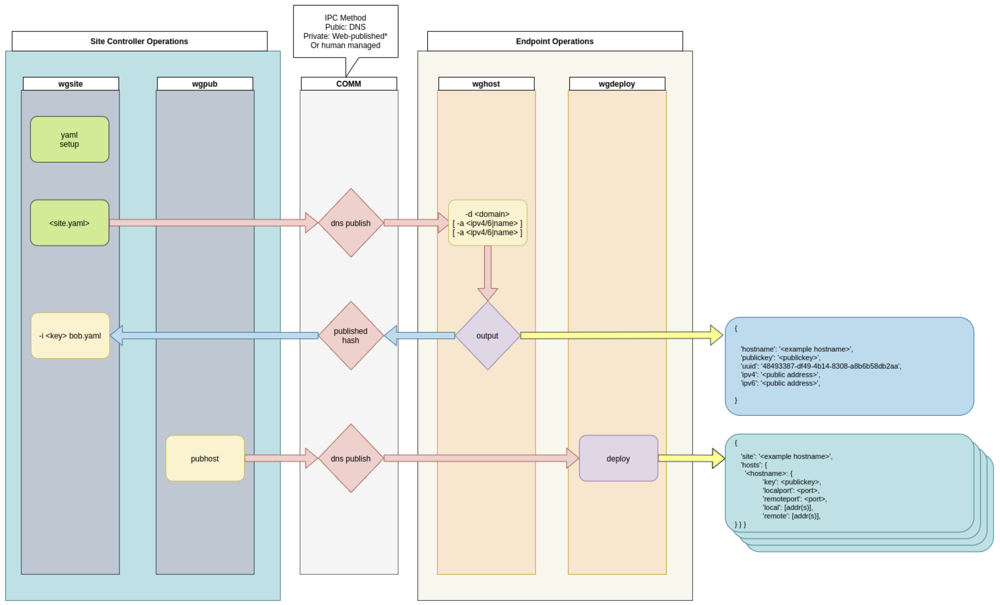

## Wireguard Mesh Tool

This is a small project designed to experiment with distribution and maintenance of Wireguard Meshes for private networks using Protocol Routing.

Of necessity, the Routing Daemons are running against the wireguard interfaces.

If there are local Routing Requirements, they are beyond the scope of this mesh development.  This is intended to produce a routing mesh - care and feeding of the mesh is your responsibility.

## Requirements

 - [Fedora](https://getfedora.org/en/server/#:~:text=Fedora%20Server%20is%20a%20short,in%20the%20open%20source%20community.) _prolly any modern linux will work_
 - [Wireguard](https://www.wireguard.com/) _included with Fedora (wireguard-tools)_
 - [Python](https://www.python.org/) _included with almost all modern linux_
 - [BIRD](https://bird.network.cz/) _modular protocol routing daemon_
 - [Shorewall](https://shorewall.org/) _local linux firewall configuration, with the simple two-interface setup_

## TODO

 - build node removal workflow.
 - wgconfig should perform the initial wghost configuration.
 - Local Site-specific configurations integration?
    - 1/2 done, calls `-local` scripts.
 - Rename netns "private" to a mesh-specific _locus_.
 - startup script should prolly be written in python.
 - Non-dns method of transmitting deploy_messages.
 - Warning command:
    - check default and private for forwarding
    - check for addresses on WG interfaces
    - Check for wg up
    - Check for veth device presence
    - Check veth addressed
  - Examine ifaddr dependency.
  - Simplify `wgconfig`, remove `wgdeploy` redundant code blocks.
  - Fix deploy template args structure so that wg/table/ifdetails are portable throughout the templates

##  Getting Started

Example config: `wgmesh.yaml`
Example Domain: `mesh.example.com`

 **Site Config**
 - Copy wgmesh-example.yaml to `wgmesh.yaml`
 - Edit the file and set the primitives.
    - The ipv6 segment should be a 48bit ULA subnet.
 - Execute site publisher: `wgsite wgmesh.yaml`
 - Publish the DNS Information. (TXT record 'mesh.example.com')

 **Endpoint Config**
 - Connect to mesh endpoints, setup python virtualenv if desired.
 - Install wgmesh package; `pip install wgmesh`
 - Setup host registration the mesh (run as root or sudo):

        wgconfig mesh.example.com

 - Configure the local host:

        wgconfig -i ens3 -T ens4 -I 172.22.15.243/24  mesh.example.com

  - Publish Site import data:

        wghost mesh.erickson.is

 **Site Config**
 - Import the host by copying the output into the site controller. `wgsite -i <hash> wgmesh.yaml`
 - Once host(s) are ready, publish Host-base DNS records: `wgpub wgmesh.yaml`
 - Publish output to the `[uuid].wgmesh.example.com` TXT records.

 **Endpoint Config**
 - Deploy on the local hosts: `wgdeploy mesh.example.com`

 Publish and deploy processes can be automated.

## Warnings:

 `wghost` setup, and `wgsite -i` must be a human-approved process, because this adds nodes (e.g. trusted keys) to the mesh.

 ## Route53 Integration

 If you are using Route53 for DNS hosting, you *may* setup automated DNS posting from the site configurator.  This causes `wgsite`, and `wgpub` to automatically update records in DNS.

 Add the `aws_access_key_id` and `aws_secret_access_key` to the Site Mesh file in the `global` section.

    global:
      aws_access_key_id: XXXXXXXXXXXXXXXXXX
      aws_secret_access_key: yyyyyyyyyyyyyyyyyyyyyyyyyyyyyyyyy

## Mesh Endpoints

The Mesh endpoints expect a VM (or machine) with two attached interfaces.  One interface should be configured for Internet access. The other interface must connect to the local LAN.

Mesh BGP Configuration is setup for exchanging routes between Mesh Endpoints across the wireguard links.  Local routing configuration can be attached using [BIRD's modular configuration](https://bird.network.cz/?get_doc&v=20&f=bird-3.html#ss3.2) capability. 

  

## Process Flow

  

 ## Ansible

  - local shorewall deployment
  - local frr deployment

## Contributing

Pull requests and feature requests gladly accepted.

_wgmesh_ is licensed under the MIT/Expat license.

 ## Changelog

  - 2020-12-04: Joshua Schmidlkofer - project setup
  - 2021-03-03: 0.5 - functional test release.
  - 2021-03-03: 0.5.1 - packaging test release.
